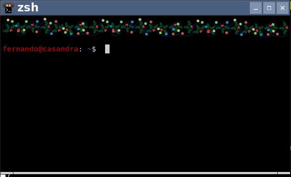

# XMAS plugin!

This draws a xmas theme on top of your terminal (using kitty protocol) with changing light colours every time you press enter.

You need to:
* Add xmas in the list of your oh-my-zsh plugins
* add $(xmas) in your prompt
```
PROMPT=$PROMPT$(xmas)
```

et voilà!




